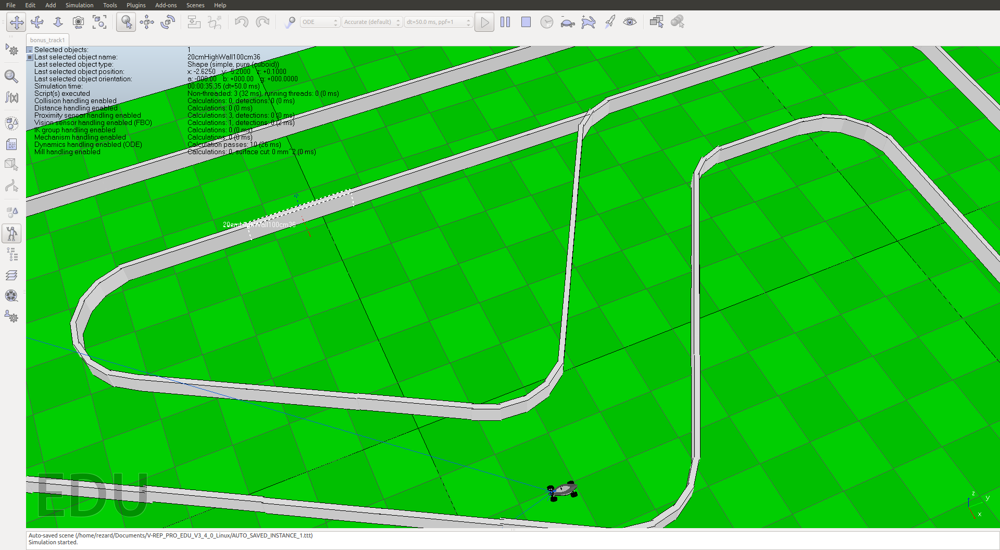

# Need4Stek

Epitech first year project : [CPE] Need4Stek

Deadline : 4 weeks

Beginning of the project : 25/04/2016, 08h42

Group size : 3 persons

Contributors:

* durand_4
* dufrec_p

# Need4Stek

Create an autonomous car.


* [Waymo](https://en.wikipedia.org/wiki/Waymo)

## Getting started

These instructions will allow you to obtain a copy of the operational project on your local machine for development and testing purposes.

The n4s binary enables communication with V-REP (via a socket in C) and controls each of the elements that we have
put in our scene.

It reads the commands sent to it on the standard input, carries out the task, and responds by writing on the standard
output.

The IA should, therefore, do the opposite: give off its commands by writing on the standard output and receive
the n4s responses by reading them on your standard input.

The command in the pipes.sh script enables you to correctly link the different binaries. Put your ai binary into the
same file as the n4s binary that is provided for you.

You’ll need to execute the pipes.sh script in order to launch the simulation and see how it interacts with the AI.

### Prerequisites

What do you need to install the software and how to install it?

```
* [Vrep (edu)](http://www.coppeliarobotics.com/downloads.html)
gcc
make
```

### Installation

Here's how to start the project on your computer

Clone and go in the directory Need4Stek

Project compilation

```
make
```

Running project

```
./vrep.sh
```

In another terminal

```
cd VREP
./pipes.sh
```
## Note

Be careful and select "ODE" and not "Bullet" mode.

## Screenshot



## Build with

* [C](https://en.wikipedia.org/wiki/C_(programming_language))

## Autor

* **David Munoz** - [DavidMunoz-dev](https://github.com/davidmunoz-dev)
